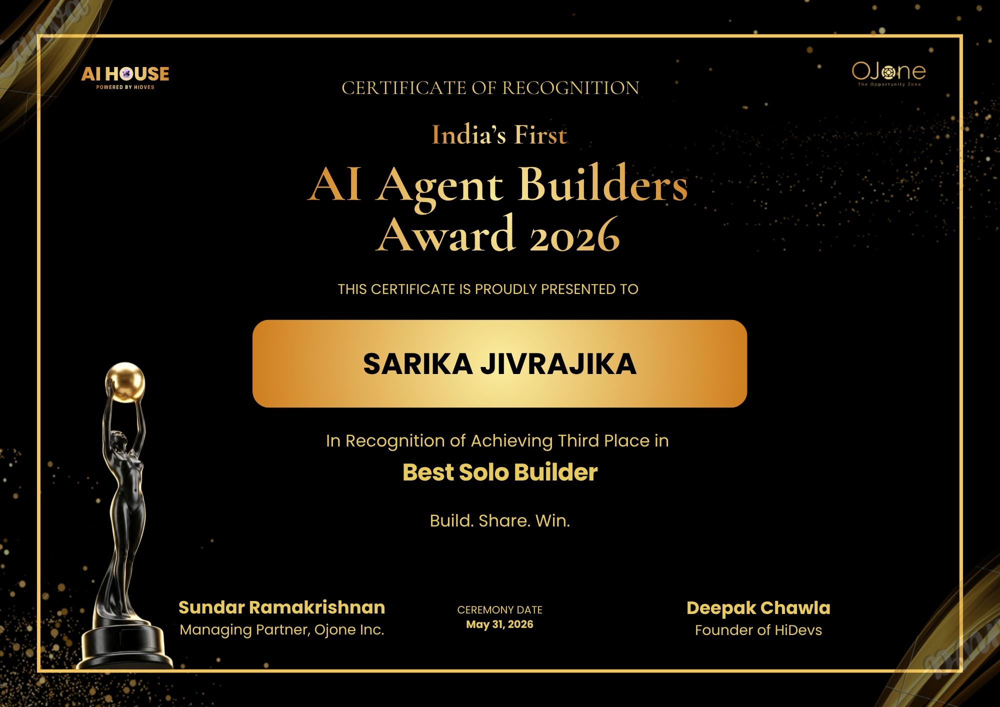
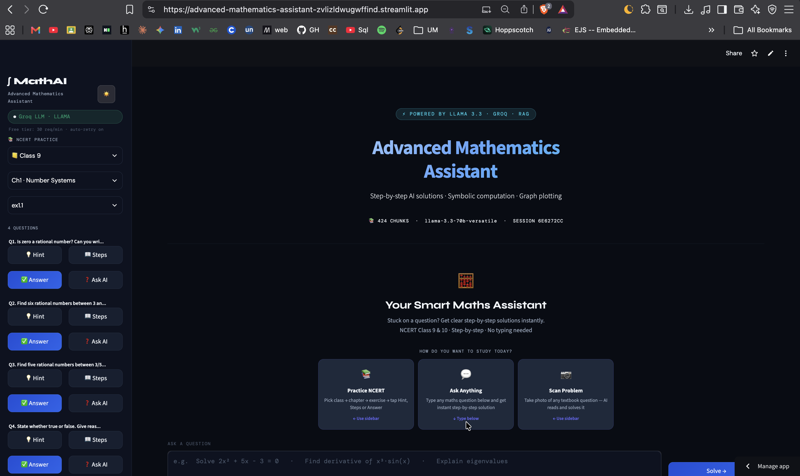
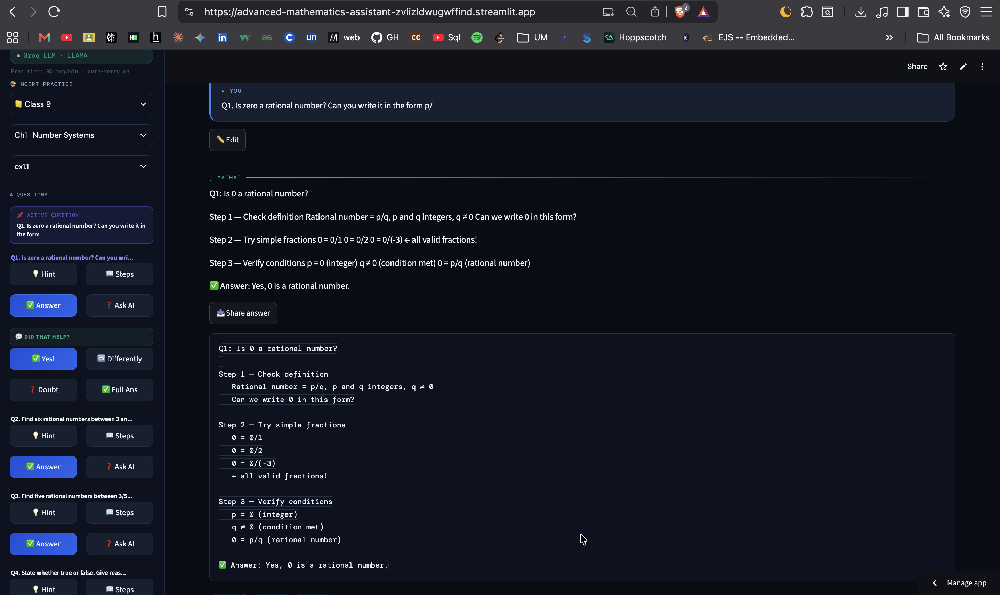

<h1 align="center">
  
</h1>
<h3 align="center">Software Engineer · Final Year, Graduating 2027</h3>

I ship products, not tutorials — real users, real deployments, built end-to-end.

🏆 <b>3rd Place, Best Solo Builder — India's First AI Agent Builders Award 2026</b> (AI House × OJone)

  
  
  

---

### 🚧 Currently

Building a live **Advanced Mathematics Assistant** — a personal project powered by LLaMA 3.3 + Groq + LangChain + RAG + SymPy, with a 118-document knowledge base spanning Class 6–JEE Advanced. Solo build, deployed, in active use.

Also shipped two full-stack MERN apps as an intern at Unified Mentor — real-time booking systems with auth, role-based access, and live deployment.

Alongside that: grinding DSA in Java daily and deepening core engineering fundamentals — targeting Software Engineer roles at product-based companies for 2026.

---

### 🏆 Recognition

  

Meta PyTorch OpenEnv Hackathon × Scaler — Round 1 Qualified (Apr 2026) &nbsp;·&nbsp; Adobe, RIFT & IISc Bengaluru Hackathons

---

### 💼 Flagship Builds

**🧮 Advanced Mathematics AI Tutor** 🏆

4-mode guided learning system (Hint → Steps → Answer → Ask AI) covering **505 NCERT questions across 87 exercises**. RAG pipeline (LangChain + ChromaDB), Plotly graphing, Tesseract OCR for handwritten problem scanning.
🥉 **India's First AI Agent Builders Award 2026 — Best Solo Builder** (AI House × OJone)
[**Live Demo →**](https://advanced-mathematics-assistant-zvlizldwugwffind.streamlit.app/) · [GitHub →](https://github.com/Sarika-stack23/Advanced-Mathematics-Assistant)
`LLaMA 3.3` `LangChain` `ChromaDB` `RAG`

See it solve a problem step-by-step →

 

 

<table>
<tr>
<td width="50%" valign="top">

**📊 Feedback Analyser**
Review-intelligence pipeline — sentiment analysis, trend detection, auto-generated PDF reports, dockerised for deployment.
`HuggingFace` `FastAPI` `Docker` `NLP`

</td>
<td width="50%" valign="top">

**📄 Resume Analyzer**
LLM-powered resume scoring — ATS compatibility, skill-gap detection, instant feedback. Built at HiDevs.
`LangChain` `Groq` `Streamlit`

</td>
</tr>
</table>

<b>More projects →</b>

 

- **CoWorkSpace** — real-time co-working space booking platform with JWT role-based access (React, Node.js, MongoDB)
- **LegacyCare** — end-of-life & funeral pre-planning platform with multi-role access (React, Node.js, MongoDB)
- **MedAILockr** — healthcare appointment booking platform with conflict-detection engine (TypeScript, React, Node.js)
- **FinTrack** — personal finance dashboard with real-time analytics (React, TypeScript, Recharts)
- **Skill-Forge** — AI skill-gap analyzer & roadmap generator (Groq LLaMA 3.3, NetworkX DAG)
- **Nyaymitra** — voice-based AI legal assistant for regional-language legal guidance
- **Recommendation System API**, **Verdict-Watch**, **CampusIQ**, **college-helpdesk-chatbot** — see pinned repos for details

---

### 🏢 Experience

| Role | Company | When |
|---|---|---|
| MERN Stack Intern | Unified Mentor (Remote) | Apr 2026 – Jul 2026 |
| GenAI Developer Intern | HiDevs (Just GenAI, Inc.) — US-based startup | Feb 2026 – Present |
| Python Programming Intern | MotionCut | Jan – Mar 2025 |
| Machine Learning Intern | 1Stop.ai × IIT Bhubaneswar | Jan – Apr 2024 |

---

### 🧰 Stack

**Languages & Core CS** `Java` `Python` `JavaScript` `TypeScript` `DSA` `OOP` `OS` `DBMS` `Computer Networks`
**Frontend** `React` `Next.js` `HTML/CSS` `Tailwind CSS`
**Backend** `Node.js` `Express` `FastAPI` `REST APIs` `JWT Auth`
**Databases** `MongoDB Atlas` `SQL` `ChromaDB (Vector DB)`
**AI / ML / GenAI** `LangChain` `LLaMA 3.3` `Groq` `HuggingFace` `RAG` `NLP` `Scikit-learn`
**Tools & Deployment** `Git` `GitHub` `Docker` `Postman` `Streamlit` `Railway` `Render` `Vercel`

---

### 🎯 Focus Areas

| Status | Topic |
|---|---|
| 🟢 Active | Software engineering internships — shipping production apps |
| 🟢 Active | DSA in Java — daily LeetCode |
| 🔵 Next | System Design |
| 🔵 Next | Docker & Kubernetes |

---

### 🎓 Education

**B.Tech, Computer Science & Engineering** — Jain (Deemed-to-be University), Bengaluru · 2023–2027 · CGPA: 8.95/10

---

### 📜 Key Certifications

- Prompt Design in Vertex AI — Google
- Develop GenAI Apps with Gemini & Streamlit — Google
- Introduction to Artificial Intelligence — IBM
- Machine Learning Internship — 1Stop.ai × IIT Bhubaneswar
- Introduction to MongoDB — MongoDB

All certifications →

 

- Build Real-World AI Apps with Gemini & Imagen — Google
- Algorithms for Searching, Sorting & Indexing — UC San Diego
- Data Fundamentals — IBM
- Creating Database Tables with SQL — Coursera
- Google Cloud Fundamentals — Google
- Introduction to Cloud Computing — IBM
- Connect and Protect: Networks & Network Security — Google
- Learn Git — IBM × Codecademy
- Introduction to Graph Theory — UC San Diego
- Operating Systems: Overview, Administration & Security — IBM

---

Open to Full-Time & Internship roles — Software Engineering — 2026

